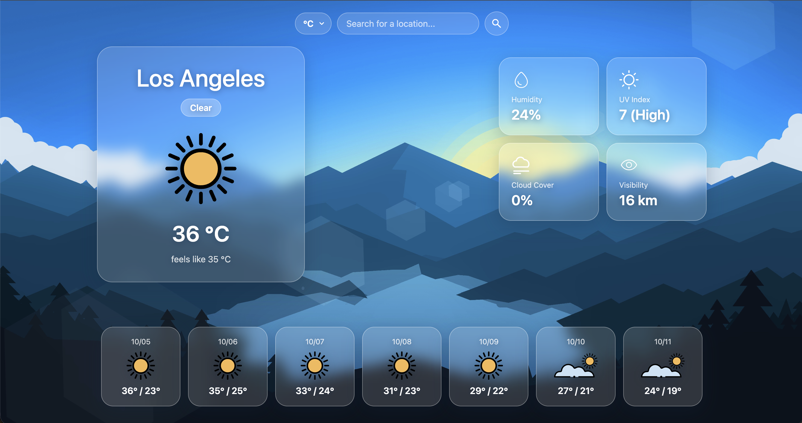

# 🌤️ Weather App


A weather forecast app built with Vanilla JavaScript, HTML, and CSS, powered by the [Visual Crossing Weather API](https://www.visualcrossing.com/weather-api). This project is part of [The Odin Project's](https://www.theodinproject.com/) JavaScript curriculum, focused on asynchronous JavaScript, working with a real API, and handling the JSON it returns.

🔗 [Live Demo](https://lucasazevedothedev.github.io/weather-app/)



## Features

- **Search Any Location:** Type a city and get its current conditions, fetched from the Visual Crossing Timeline API with `async`/`await`.
- **Current Conditions Card:** City name, condition label, a matching weather icon, temperature, and "feels like" temperature.
- **Weather Details:** Humidity, UV index (with a Low → Extreme rating), cloud cover, and visibility, each in its own tile.
- **7-Day Forecast:** Date, icon, and max/min temperatures for the next seven days.
- **°C / °F Toggle:** Switches every temperature on the page instantly, without a new API request, and the selected unit stays applied to future searches.
- **Dynamic Weather Icons:** Each condition icon is loaded on demand with a dynamic `import()`, using the API's `icon` value as the file name.
- **Error Messages:** Clear feedback for an empty search or a location the API can't find.
- **Frosted-Glass UI:** Translucent, blurred cards and controls whose colors are taken from the background illustration.

## Key Learnings

- **Async JavaScript & APIs:** Fetching data with `fetch` and `async`/`await`, parsing the JSON response, and catching failed requests with `try`/`catch`.
- **Dynamic Imports:** Loading the right icon at runtime with ``import(`../photos/conditions/${icon}.svg`)``, learning that `import()` returns a Promise and that the file's URL lives in `module.default`.
- **Webpack Asset Handling:** How `asset/resource` turns an imported SVG into a URL for an ``, why CSS can't recolor an SVG loaded that way, and that the dev server must be restarted when files loaded by a dynamic import are moved or added.
- **Keeping State for Re-rendering:** Storing the last API response in a module-level variable so the unit toggle can convert temperatures without fetching again.
- **Selecting Many Elements:** Using `querySelectorAll` with a class selector and matching each element's index to the forecast day it belongs to.
- **Refactoring for Reuse:** Pulling the unit-conversion logic into its own function so both the toggle and every new search share the same code.
- **String Handling:** Cleaning up the API's `resolvedAddress` with `split(",")[0]` to show only the city name.

## How to Run Locally

```bash
git clone https://github.com/LucasAzevedoTheDev/weather-app.git
cd weather-app
npm install
npx webpack serve
```

Then open `http://localhost:8080` in your browser.

---
Developed by [Lucas Azevedo](https://github.com/LucasAzevedoTheDev)
